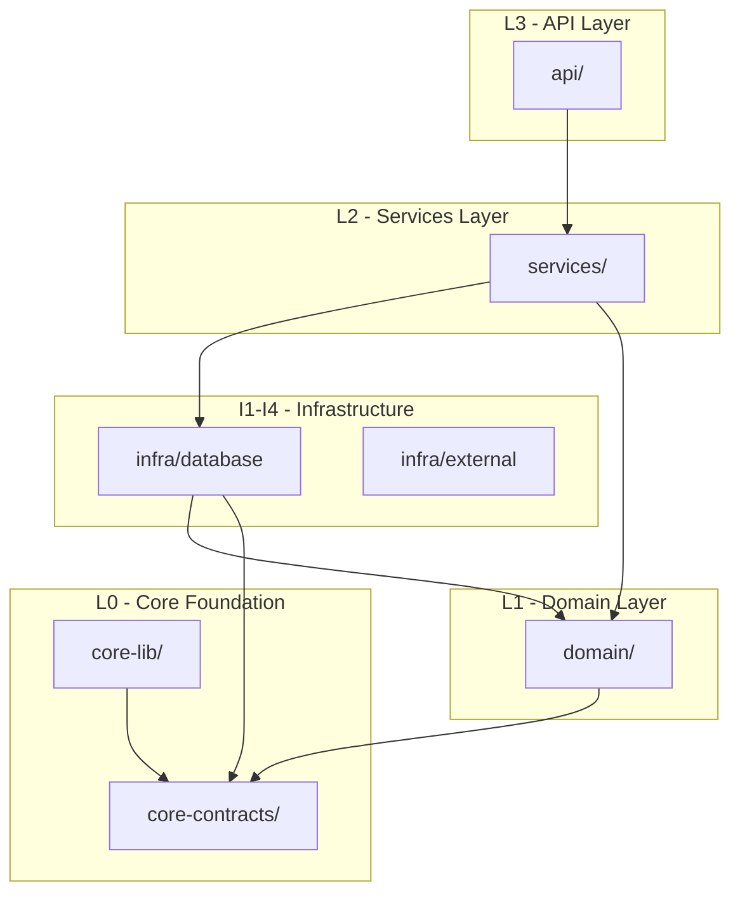
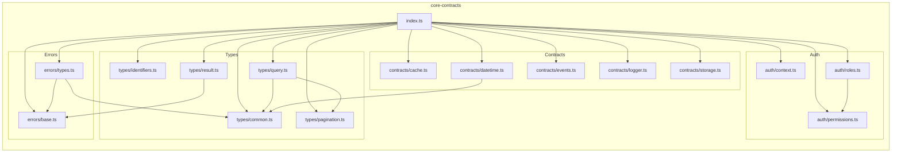
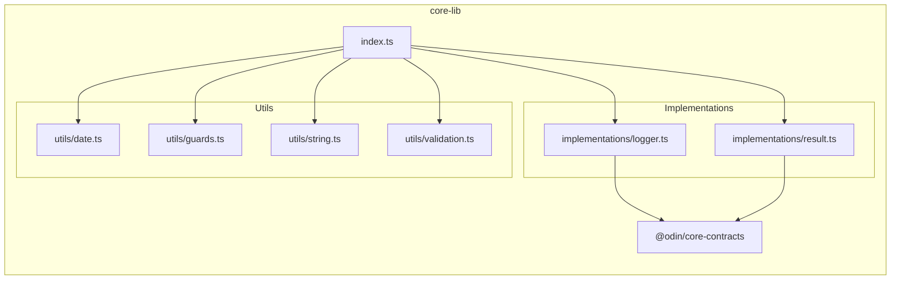
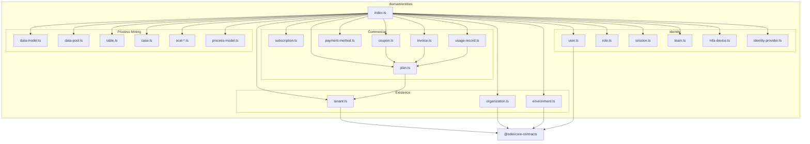
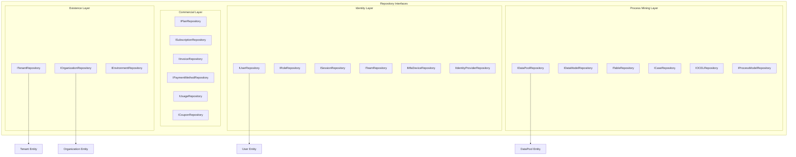
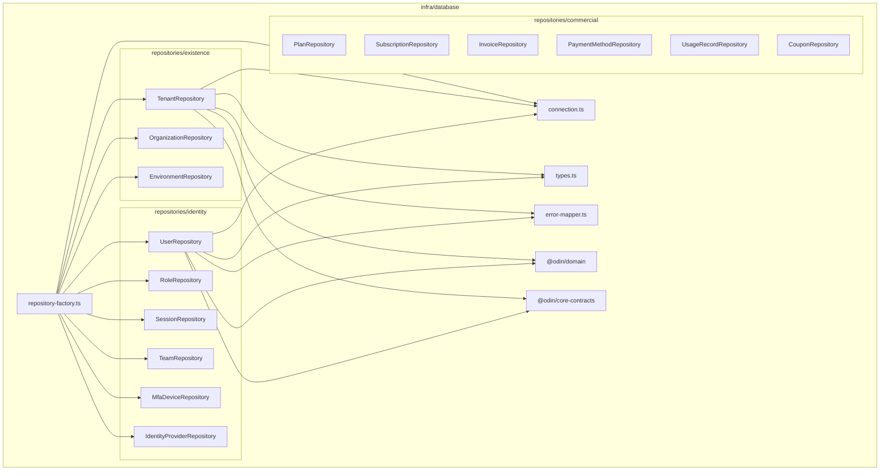
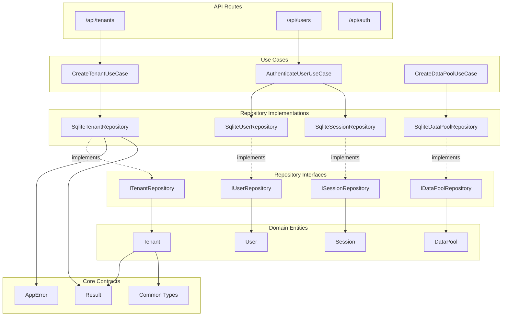
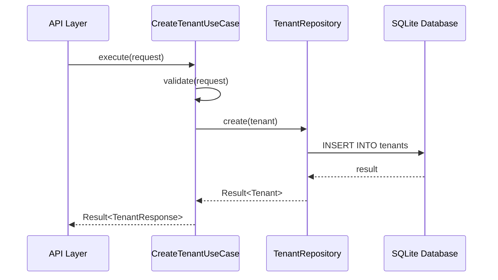
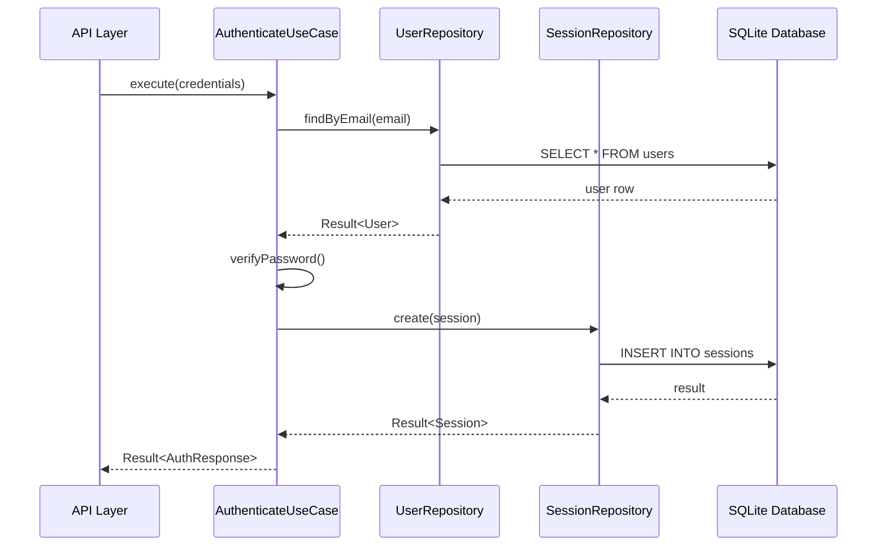
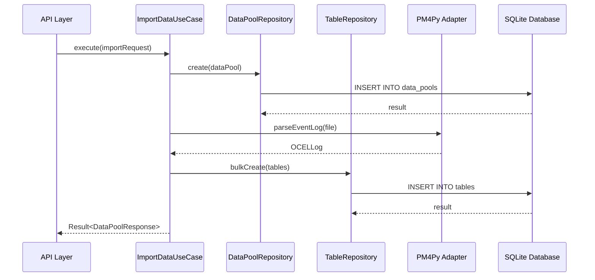

# ODIN Call Graph Documentation

> Comprehensive dependency and call graph analysis for the ODIN Process Mining Platform

**Generated:** December 27, 2024  
**Files Analyzed:** 198 TypeScript files  
**Circular Dependencies:** ✅ None detected

---

## Table of Contents

1. [Architecture Overview](#architecture-overview)
2. [Package-Level Dependencies](#package-level-dependencies)
3. [Layer-by-Layer Call Graphs](#layer-by-layer-call-graphs)
4. [Cross-Layer Dependencies](#cross-layer-dependencies)
5. [Visual Diagrams](#visual-diagrams)

---

## Architecture Overview

ODIN follows a strict DDD (Domain-Driven Design) architecture with clear layer separation:

---

## Package-Level Dependencies

### core-contracts (L0 - Foundation)

The foundation layer with zero external dependencies.

### core-lib (L0 - Utilities)

---

## Layer-by-Layer Call Graphs

### Domain Layer - Entities

### Domain Layer - Repositories

### Infrastructure Layer - Repository Implementations

---

## Cross-Layer Dependencies

### Complete Dependency Flow

---

## Visual Diagrams

The following SVG files have been generated in `docs/architecture/`:

| File                                                 | Description                          |
| ---------------------------------------------------- | ------------------------------------ |
| [core-contracts-deps.svg](./core-contracts-deps.svg) | Core contracts internal dependencies |
| [domain-entities.svg](./domain-entities.svg)         | Domain entity relationships          |
| [domain-repositories.svg](./domain-repositories.svg) | Repository interface dependencies    |
| [full-deps.json](./full-deps.json)                   | Raw JSON dependency data (198 files) |

---

## Statistics

### File Count by Package

| Package        | Files | Status          |
| -------------- | ----- | --------------- |
| core-contracts | 21    | ✅ Complete     |
| core-lib       | 9     | ✅ Complete     |
| domain         | 48    | ✅ Complete     |
| infra          | 52    | 🟡 28% Complete |
| services       | 2     | 🔴 Scaffolded   |
| api            | 3     | 🔴 Scaffolded   |

### Repository Implementation Status

| Layer          | Interfaces | Implemented | Coverage |
| -------------- | ---------- | ----------- | -------- |
| Existence      | 3          | 3           | 100%     |
| Identity       | 6          | 6           | 100%     |
| Commercial     | 6          | 6           | 100%     |
| Operational    | 3          | 3           | 100%     |
| Temporal       | 3          | 3           | 100%     |
| Integration    | 4          | 4           | 100%     |
| Process Mining | 6          | 6           | 100%     |
| Analytics      | 5          | 5           | 100%     |
| Studio         | 4          | 4           | 100%     |
| Automation     | 6          | 6           | 100%     |

---

## Key Call Chains

### 1. Tenant Creation Flow

### 2. User Authentication Flow

### 3. Data Pool Import Flow

---

## Next Steps

1. **Function-Level Analysis** - Use ts-morph for detailed method call tracking
2. **Event Flow Diagrams** - Map domain event publishers and subscribers
3. **API Route Documentation** - Generate OpenAPI specs from routes
4. **Interactive HTML** - Create d3.js-based interactive dependency explorer

---

_Generated with madge + graphviz + mermaid_
